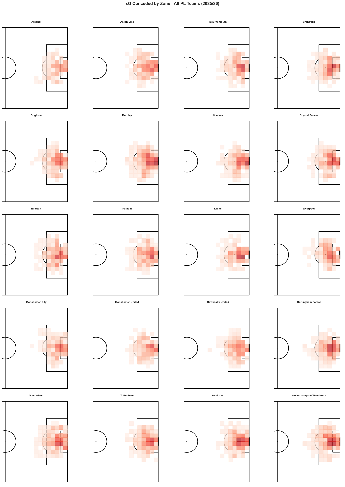
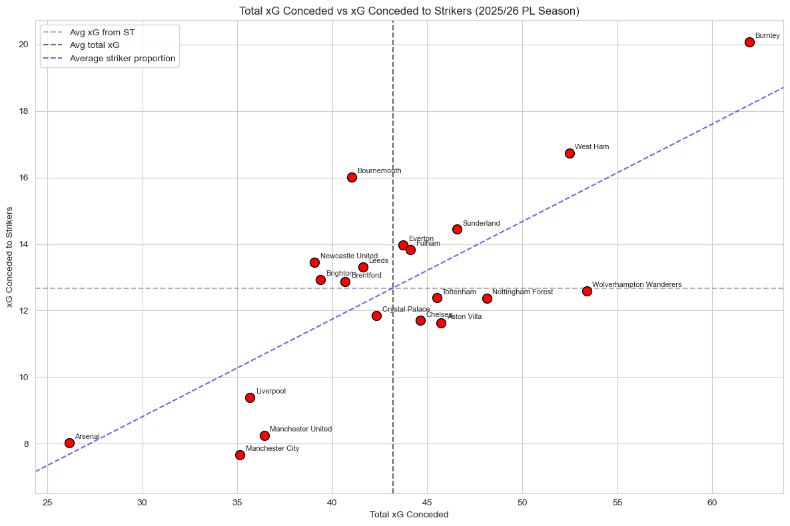

# Where Defenses Break and Attacks Convert

### An xG Analysis of the 2025/26 Premier League

This project analyzes expected goals (xG) across the 2025/26 Premier League season to understand how teams concede and create chances. Using shot-level data from Understat, we map where each team gives up the most danger on the pitch, identify which attacking positions exploit each defense most, and examine attacking output through finishing efficiency, late-game clutch performance, and passer-shooter partnerships.

Completed for ECON 570 (Data Analysis in Economics) at the University of Wisconsin–Madison.

---

## Why xG?

Goals win games but they hide more than they reveal. A 1–0 result tells you who got three points, not whether one team was outplayed for ninety minutes or ran into a hot goalkeeper. Expected goals fills both gaps by assigning each shot a probability of becoming a goal based on its location and the type of attack. Summing those probabilities across a season gives a cleaner read on the chances a team created and the chances they allowed.

---

## Key Findings

**Defensive quality varies in shape, not just volume.** Arsenal, Liverpool, and Manchester City show light, narrow heatmaps with shots clustered near the penalty spot. Weaker defenses like Burnley, West Ham, and Wolves spread out into the half-spaces and wide areas, indicating opponents create from a wider variety of positions.

**Burnley is the worst defense on every measure** — most total xG conceded and most xG conceded to opposing strikers. Wolves are a structural outlier: high total xG conceded but a below-average share to strikers, suggesting their back-five shape crowds the striker but lets damage through from wider attackers and midfield runners.

**The league as a whole underperformed xG.** Nearly every team scored fewer goals than their chance quality predicted. Tottenham was the only clear overperformer. Chelsea led the league in xG generated (64.6) at the highest per-shot quality (0.156).

**Clutch finishing separates real value from aggregate stats.** Mohamed Salah converted late-game chances at roughly double the rate their quality predicted (3 goals on 1.45 xG), the highest clutch delta in the league.

---

## Figures

### Where each team concedes xG



Heatmap of xG conceded by zone for each Premier League team. Color scale is shared across all twenty panels using log scaling, so panels are directly comparable.

### Total xG conceded vs xG conceded to strikers



Each team's total xG conceded plotted against xG conceded specifically to opposing strikers. Teams above the diagonal give up a disproportionate share of their xG to strikers.

---

## Data

Shot-level data from [Understat](https://understat.com) for the 2025/26 Premier League season. Each row is a single shot with the team taking it, the team defending, the player, the X/Y coordinates, the xG value, and the situation that produced the shot. The dataset contains 7,451 shots across all twenty Premier League teams. Penalty kicks (fixed location, xG ~0.76) are dropped from defensive analysis.

Understat does not record player positions, so we built a player-to-position map by hand for the positional analysis, sorting roughly 300 players into nine roles ranging from center back to striker.

---

## Repository Structure

```
pl-xg-analysis-2025/
├── README.md
├── Project Report.pdf        Three-page project report
├── Python-Code.ipynb         Analysis notebook (all figures and tables)
├── pl_2025_shots.csv         Shot-level data from Understat
└── figures/                  Standalone figure exports for the README
```

---

## Running the Notebook

```bash
pip install pandas numpy matplotlib seaborn mplsoccer
jupyter notebook Python-Code.ipynb
```

The notebook reads `pl_2025_shots.csv` from the same directory and produces all figures and tables in the report.

---

## Team

- Faraz Behlum
- Bach Pham
- Luke DeFrance
- Allan Biju Gregory

University of Wisconsin–Madison, ECON 570: Data Analysis in Economics, Spring 2026.

---

## Data Source

Understat, https://understat.com. Premier League shot data for the 2025/26 season.
